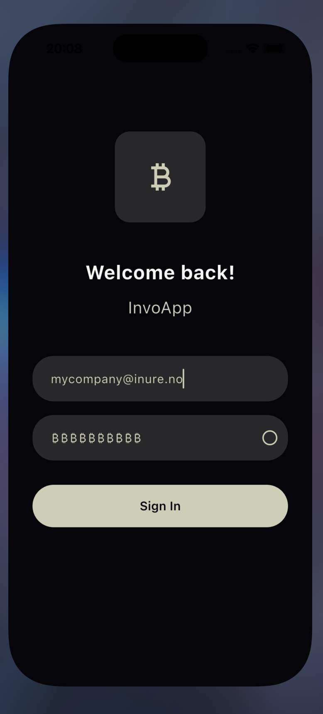
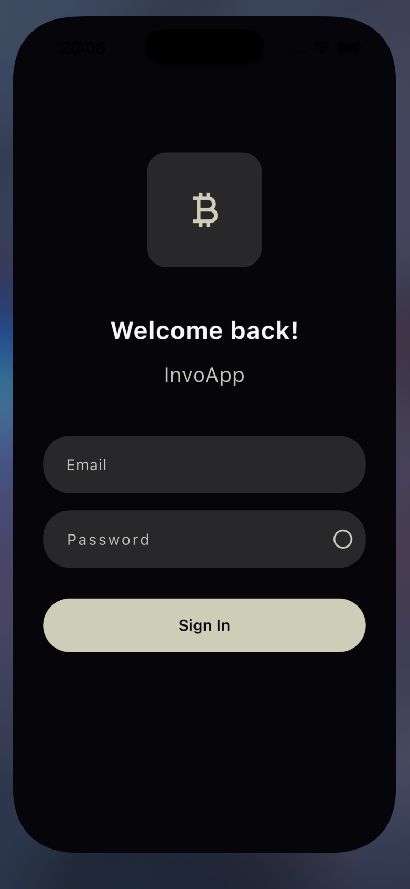
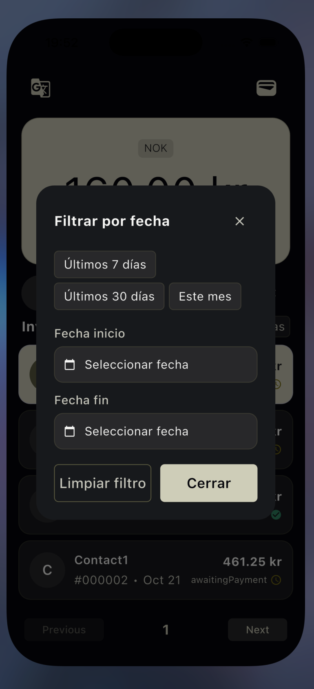
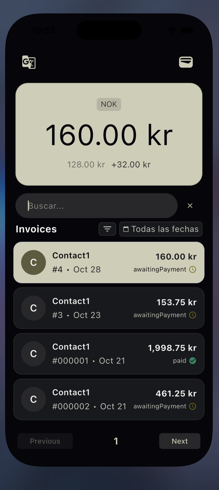
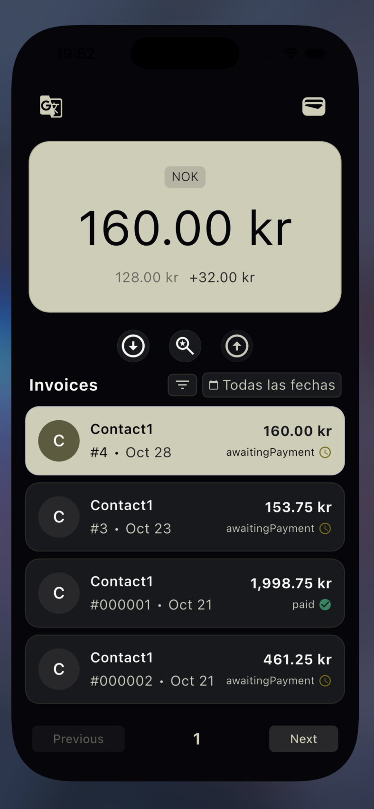

# InvoApp

Aplicación de listado de facturas (Flutter) — interfaz de ejemplo con navegación, búsqueda, filtros por fecha y paginación.



Descripción
---------
InvoApp es una aplicación móvil construida con Flutter que muestra facturas, permite buscar, filtrar por fechas, navegar entre facturas y cargar páginas adicionales cuando se llega al final de la lista.

Características destacadas
--------------------------
- PageView sincronizado con una lista inferior y selección de items.
- Búsqueda con debounce y limpieza de filtros.
- Filtro por fechas con diálogo y acciones rápidas (últimos 7/30 días, mes actual).
- Temas y personalización visual (cursor color, tamaños, etc.).

Capturas
-------
Pantallas (carpeta `blueprints`):

- Vista principal


- Navegación y búsqueda



- Lista de facturas



- Filtro por fecha



- Detalle / tarjeta



Requisitos
---------
- Flutter 3.0+ (recomendado). Asegúrate de tener el SDK y las herramientas instaladas: https://flutter.dev/docs/get-started/install
- Xcode (macOS) para construir en iOS.
- Android SDK / Android Studio para Android.

Instalación y ejecución
----------------------
1. Clona el repositorio y entra en la carpeta del proyecto:

```bash
git clone <tu-repo-url>
cd invoapp
```

2. Instala dependencias:

```bash
flutter pub get
```

3. Genera ficheros:

```bash
flutter pub run build_runner build --delete-conflicting-outputs
```

4. Ejecuta la app en un emulador o dispositivo conectado:

```bash
flutter run
```

Construcción iOS
----------------
Si vas a compilar para iOS desde macOS, recuerda instalar pods:

```bash
cd ios
pod install
cd ..
flutter build ios
```

Dónde mirar logs
----------------
- Ejecuta la app con `flutter run` y revisa la consola: los BLoC registran información útil para debugging.
- Para salida más detallada usa `flutter run -v` o `adb logcat` en Android.

Estructura del proyecto (resumen)
--------------------------------
- `lib/` - código fuente Flutter
  - `presentation/` - vistas, widgets y páginas
  - `domain/` - entidades y modelos
  - `data/` y `service/` - llamadas a API / repositorios
  - `core/` - utilidades, tema y localización
- `assets/`, `ios/`, `android/` - recursos y configuraciones nativas
- `blueprints/` - capturas y diseños de referencia
